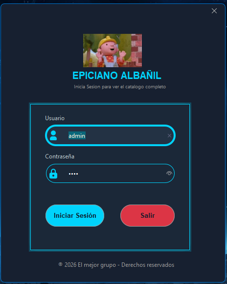
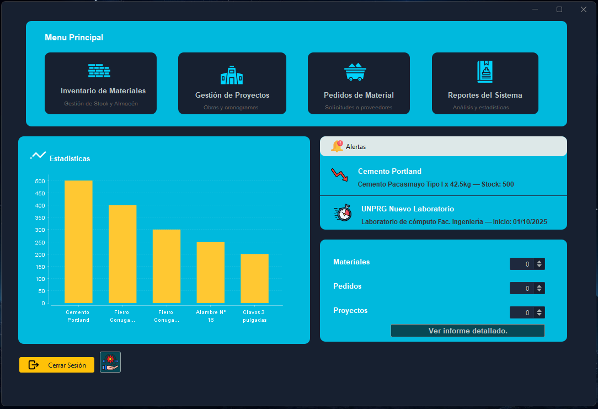
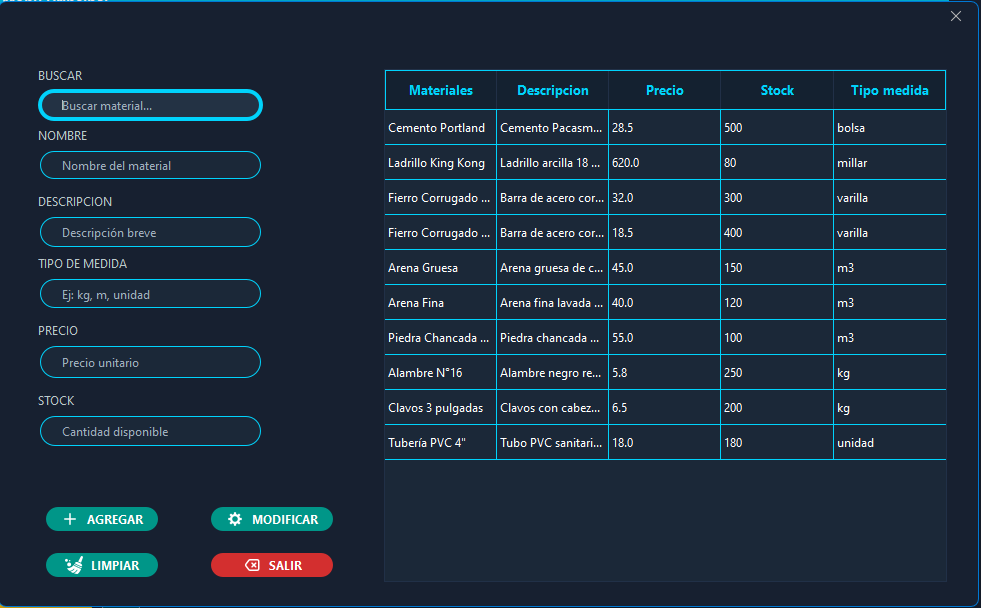
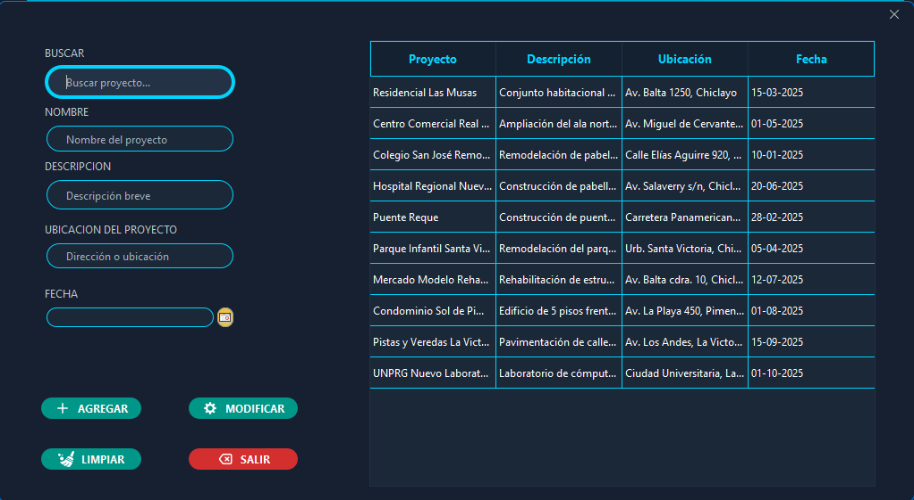
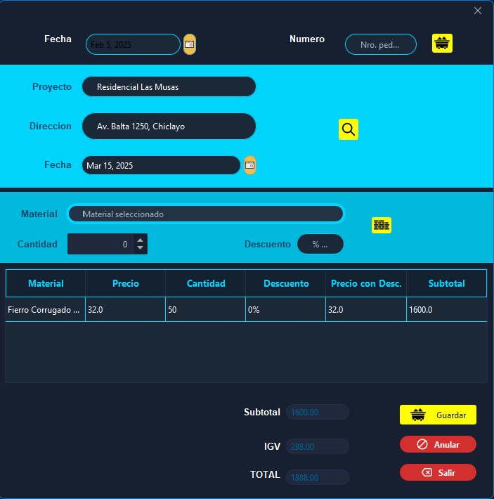
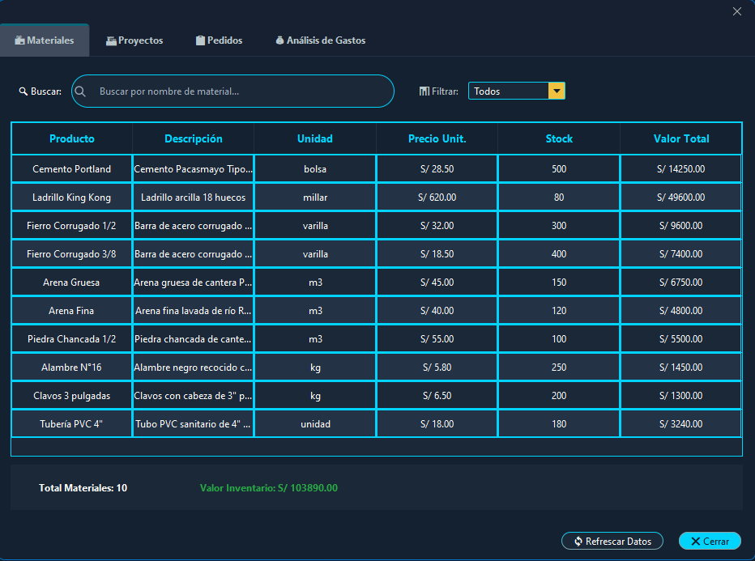
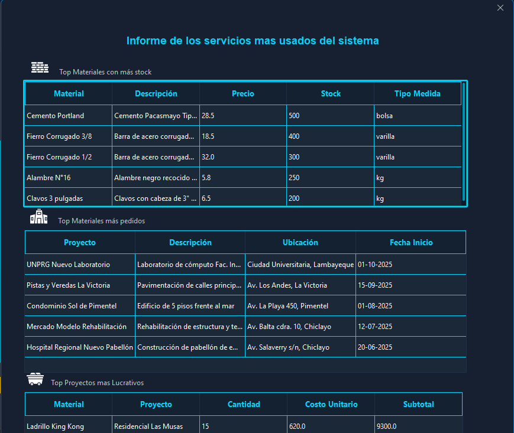

# 🏗️ Sistema de Gestión de Proyectos y Materiales de Construcción

Sistema de interfaz gráfica desarrollado en **Java Swing** para la gestión integral de materiales de construcción, proyectos y pedidos. Permite llevar un control detallado de los recursos utilizados en cada proyecto, generar reportes y visualizar estadísticas de gastos y stock.

---

## 📋 Tabla de Contenidos

- [Características](#-características)
- [Capturas de Pantalla](#-capturas-de-pantalla)
- [Arquitectura](#-arquitectura)
- [Tecnologías](#-tecnologías)
- [Requisitos](#-requisitos)
- [Instalación](#-instalación)
- [Uso](#-uso)
- [Estructura del Proyecto](#-estructura-del-proyecto)
- [Desarrolladores](#-desarrolladores)

---

## ✨ Características

- ✅ **Gestión de Proyectos**: Crear, editar y eliminar proyectos de construcción
- ✅ **Control de Materiales**: Administrar inventario de materiales con stock, precios y unidades de medida
- ✅ **Gestión de Pedidos**: Registrar pedidos de materiales asociados a proyectos específicos
- ✅ **Reportes y Estadísticas**: Visualización de gastos por proyecto y material mediante gráficos
- ✅ **Alertas de Stock Bajo**: Notificaciones cuando el inventario está por debajo del umbral
- ✅ **Persistencia de Datos**: Almacenamiento de información en archivos serializados
- ✅ **Interfaz Moderna**: Diseño con temas FlatLaf para una experiencia visual agradable
- ✅ **Sistema de Login**: Autenticación de usuarios para acceso seguro

---

## 📸 Capturas de Pantalla

### 🔐 Login


### 🏠 Panel Principal


### 📦 Gestión de Materiales


### 🏗️ Gestión de Proyectos


### 📝 Gestión de Pedidos


### 📊 Reportes


### 📈 Detalle de Reportes de Servicios


---

## 🏛️ Arquitectura

El proyecto sigue una arquitectura de **3 capas** para una mejor organización y mantenibilidad:

```
┌─────────────────────────────────────┐
│       CAPA DE PRESENTACIÓN          │
│   (Interfaces gráficas - Swing)     │
├─────────────────────────────────────┤
│         CAPA DE LÓGICA              │
│   (Modelos y Servicios de negocio)  │
├─────────────────────────────────────┤
│         CAPA DE DATOS               │
│   (DAO - Acceso a datos/archivos)   │
└─────────────────────────────────────┘
```

### Capas del Sistema:

| Capa | Paquete | Responsabilidad |
|------|---------|-----------------|
| **Presentación** | `unprg.capa_presentacion` | Interfaces gráficas, formularios y diálogos |
| **Lógica** | `unprg.capa_logica` | Modelos de datos y servicios de negocio |
| **Datos** | `unprg.capa_datos` | Persistencia y acceso a datos mediante archivos |

---

## 🛠️ Tecnologías

| Tecnología | Versión | Uso |
|------------|---------|-----|
| **Java** | 22 | Lenguaje de programación principal |
| **Maven** | 3.x | Gestión de dependencias y build |
| **FlatLaf** | 3.3 | Look and Feel moderno para Swing |
| **JCalendar** | 1.4 | Selector de fechas |
| **JFreeChart** | 1.5.4 | Generación de gráficos estadísticos |
| **NetBeans** | - | IDE de desarrollo (GUI Builder) |

---

## 📦 Requisitos

- **JDK 22** o superior
- **Apache Maven 3.6+**
- **IDE**: NetBeans, IntelliJ IDEA o VS Code con extensiones Java

---

## 🚀 Instalación

1. **Clonar el repositorio**
   ```bash
   git clone <url-del-repositorio>
   cd PA_02
   ```

2. **Compilar el proyecto**
   ```bash
   mvn clean compile
   ```

3. **Ejecutar la aplicación**
   ```bash
   mvn exec:java
   ```

   O también:
   ```bash
   mvn package
   java -jar target/PA_02-1.0-SNAPSHOT.jar
   ```

---

## 💻 Uso

1. **Iniciar sesión** con las credenciales de usuario
2. Desde el **panel principal**, acceder a las diferentes secciones:
   - 📦 **Materiales**: Gestionar el inventario de materiales
   - 🏗️ **Proyectos**: Administrar proyectos de construcción
   - 📝 **Pedidos**: Registrar solicitudes de materiales para proyectos
   - 📊 **Reportes**: Ver estadísticas y generar informes

---

## 📁 Estructura del Proyecto

```
PA_02/
├── 📄 pom.xml                          # Configuración Maven
├── 📄 README.md                        # Este archivo
├── 📂 assets/                          # Capturas de pantalla
│   ├── login.png
│   ├── panelPrincipal.png
│   ├── dialogMateriales.png
│   ├── dialogProyectos.png
│   ├── dialogPedidos.png
│   ├── dialogReportes.png
│   └── dialogDetalleReporteServicios.png
├── 📂 data/                            # Archivos de datos serializados
└── 📂 src/
    └── main/
        ├── java/unprg/
        │   ├── 📂 capa_datos/          # Capa de acceso a datos
        │   │   ├── ArchivoHelper.java
        │   │   ├── IGenericDAO.java
        │   │   ├── MaterialDAO.java
        │   │   ├── PedidoDAO.java
        │   │   └── ProyectoDAO.java
        │   ├── 📂 capa_logica/
        │   │   ├── modelos/            # Entidades del sistema
        │   │   │   ├── Material.java
        │   │   │   ├── Pedido.java
        │   │   │   ├── Proyecto.java
        │   │   │   └── Usuario.java
        │   │   └── servicios/          # Lógica de negocio
        │   │       ├── MaterialService.java
        │   │       └── ReporteService.java
        │   └── 📂 capa_presentacion/   # Interfaces gráficas
        │       ├── PA_02.java          # Clase principal
        │       ├── frmMenu.java        # Ventana principal
        │       ├── jdLogin.java        # Diálogo de login
        │       ├── JdMateriales.java   # Gestión de materiales
        │       ├── JdProyectos.java    # Gestión de proyectos
        │       ├── JdPedidos.java      # Gestión de pedidos
        │       ├── JdReportes.java     # Visualización de reportes
        │       ├── JdInforme.java      # Generación de informes
        │       └── utils/
        │           └── UiHelper.java   # Utilidades de interfaz
        └── resources/
            └── icons/                  # Iconos SVG de la aplicación
```

---

## 📊 Modelos de Datos

### Material
| Atributo | Tipo | Descripción |
|----------|------|-------------|
| nombProducto | String | Nombre del material |
| descripcion | String | Descripción detallada |
| precioUnitario | double | Precio por unidad |
| stock | int | Cantidad disponible |
| unidadMedida | String | Unidad de medida (kg, m, unidad, etc.) |

### Proyecto
| Atributo | Tipo | Descripción |
|----------|------|-------------|
| nombreProyecto | String | Nombre del proyecto |
| descripcion | String | Descripción del proyecto |
| direccion | String | Ubicación del proyecto |
| fechaInicio | Date | Fecha de inicio |

### Pedido
| Atributo | Tipo | Descripción |
|----------|------|-------------|
| nombreProyecto | String | Proyecto asociado |
| nombreMaterial | String | Material solicitado |
| cantidad | int | Cantidad pedida |
| fechaPedido | Date | Fecha del pedido |
| costoUnitarioAlMomento | double | Precio al momento del pedido |

---

## 👨‍💻 Desarrolladores

| Desarrollador | GitHub | Contribución |
|---------------|--------|-------------|
| **Fernandez** | [@fernandez](https://github.com/jackhfernandez) | Logica de negocio, servicios y arquitectura |
| **Farro** | [@farro](https://github.com/mfarro1522) | Diseño UI/UX, interfaces y estadísticas |

---

## 📄 Licencia

Este proyecto fue desarrollado con fines educativos para la **Universidad Nacional Pedro Ruiz Gallo (UNPRG)**.

---

<p align="center">
  <i>Sistema de Gestión de Materiales de Construcción © 2026</i>
</p>
